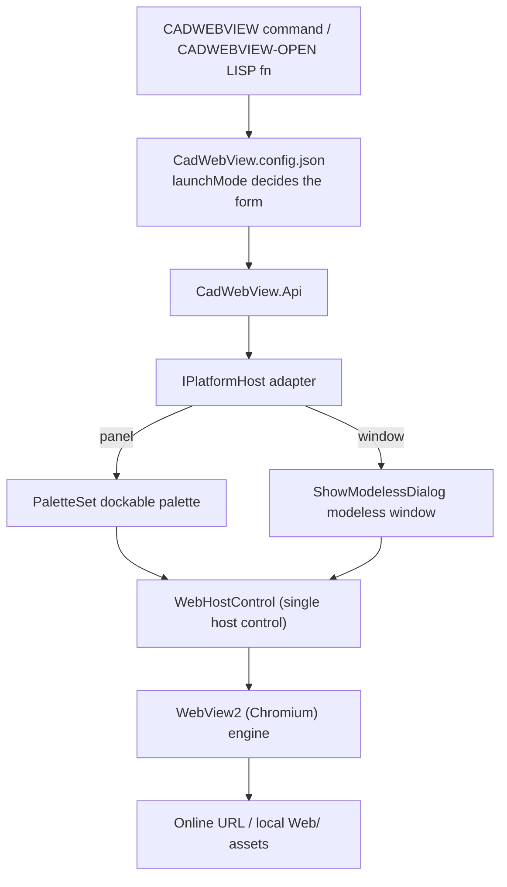

<div align="center">

# CadWebView

**Open web pages inside CAD — one codebase for AutoCAD, ZWCAD and GstarCAD**

Powered by the WebView2 (Chromium) engine, rendering online URLs and local HTML in a **dockable palette** or a **modeless window**.

[](LICENSE)
[](https://dotnet.microsoft.com/)
[](#platform-and-version-support)
[](https://developer.microsoft.com/microsoft-edge/webview2/)

[中文](README.md) · [English](README.en.md)

</div>

---

## Table of Contents

- [Why CadWebView](#why-cadwebview)
- [Features](#features)
- [Platform and Version Support](#platform-and-version-support)
- [Quick Start](#quick-start)
- [Usage](#usage)
- [Configuration](#configuration)
- [Building from Source](#building-from-source)
- [Project Structure](#project-structure)
- [How It Works](#how-it-works)
- [FAQ](#faq)
- [Known Limitations and Roadmap](#known-limitations-and-roadmap)
- [Contributing](#contributing)
- [License](#license)

---

## Why CadWebView

CAD users constantly need **help docs, dashboards, or internal web apps** while drafting. Jumping out to a system browser and back is disruptive.

CadWebView keeps you **inside CAD**:

- Run `CADWEBVIEW`, or call the LISP function `(cadwebview-open "https://...")`;
- The page shows up in a **dockable palette** or a **modeless floating window**, without blocking drafting;
- AutoCAD, ZWCAD and GstarCAD **share one codebase** — only a thin platform adapter differs.

---

## Features

- **Write once, run on three platforms** — all three CADs expose AutoCAD-shaped .NET APIs, so a single adapter source is reused via `#if` + `global using` namespace aliases.
- **Modern rendering engine** — WebView2 (Chromium); no IE compatibility-mode registry hacks, no IE rendering limits.
- **Two UI forms, one control** — dockable palette and modeless window share the same `WebHostControl`; switched by config, and never duplicated (singleton).
- **Online and local pages** — any URL, plus local `Web/` assets shipped with the plugin (relative path resolution).
- **Native LISP entry point** — the `CADWEBVIEW-OPEN` function lets scripts open a page without any interactive prompt.
- **Config-driven, no command-line interruption** — default page, launch form, size and fallback page all live in `CadWebView.config.json`.
- **Graceful degradation** — missing WebView2 Runtime or a failed navigation shows a built-in notice page with a download link; nothing throws, CAD startup is never blocked.
- **Auto-loaded in AutoCAD** — packaged as an AppBundle (`.bundle`) whose `PackageContents.xml` selects the right DLL per host version. No NETLOAD required. A flat `deliver/AutoCAD/` folder is also provided for manual `NETLOAD` loading.

---

## Platform and Version Support

Artifacts are split by **platform × runtime family** (not per release year), so multiple versions in the same family share one DLL.

| Platform | Versions | Artifact (target framework) |
|---|---|---|
| AutoCAD | 2016 – 2024 | `CadWebView.AutoCAD.Fx.dll` (net462) |
| AutoCAD | 2025 – 2026 | `CadWebView.AutoCAD.N8.dll` (net8.0-windows) |
| AutoCAD | 2027+ | `CadWebView.AutoCAD.N10.dll` (net10.0-windows) |
| ZWCAD | 2025 – 2026 | `CadWebView.ZWCAD.Fx.dll` (net47) |
| GstarCAD | 2026 – 2027 | `CadWebView.GstarCAD.N8.dll` (net8.0-windows) |

**Vertical editions** (Mechanical / Architecture / MEP / Electrical, etc.) share the same base .NET API as the standard editions, so **no separate build is needed** — the same DLL works.

> **Prerequisite**: the target machine needs the **Microsoft Edge WebView2 Runtime** (usually preinstalled on Windows 10 1809+, Windows 11, and any machine with AutoCAD 2025+). If missing, the plugin shows a notice page with a download link instead of crashing CAD.

---

## Quick Start

### 1. Requirements

| Item | Requirement |
|---|---|
| OS | Windows x64 |
| .NET SDK | **8** and **10** (for `net8.0-windows` / `net10.0-windows`; net462 comes from NuGet reference assemblies) |
| CAD SDKs | ObjectARX **2016 / 2025 / 2027**, ZWCAD SDK **2025**, GstarCAD SDK **2026** |
| Runtime | Microsoft Edge WebView2 Runtime |

SDKs are read from `D:\SDK` by default, following the layout in [build/sdk-paths.props](build/sdk-paths.props). Override with an environment variable:

```powershell
$env:CadWebViewSdkRoot = 'E:\SDK'
```

**Where to download the SDKs**

| SDK | Download |
|---|---|
| ObjectARX (AutoCAD 2016 / 2025 / 2027) | [ObjectARX for AutoCAD SDK](https://aps.autodesk.com/developer/overview/autocad-objectarx-sdk) (requires an Autodesk account and accepting the license agreement; older releases via [Autodesk Developer Network](https://www.autodesk.com/developer-network/platform-technologies/autocad)) |
| ZWCAD SDK 2025 | [ZWCAD developer support](https://www.zwsoft.cn/support/zwcad-devdoc) (SDK package, developer guide, reference manual and migration notes; see also the [ZWCAD download center](https://www.zwsoft.cn/download)) |
| GstarCAD SDK 2026 | [GstarCAD developer tools](https://www.gstarcad.com/sdk_doc/) (GRXSDK plus per-language documentation; see also the [GstarCAD developer center](https://www.gstarcad.com/developer/)) |

> After extracting, place the SDKs as expected by [build/sdk-paths.props](build/sdk-paths.props): `D:\SDK\ARX\<2016|2025|2027>`, `D:\SDK\ZCAD\2025`, `D:\SDK\Gstar\2026\grxsdk`.

### 2. Get the code

```powershell
git clone <this-repository-url> oddob-cadwebview
cd oddob-cadwebview
```

### 3. Build and package

```powershell
powershell -ExecutionPolicy Bypass -File build\build-all.ps1
```

Optional: `-Version 1.2.0` sets the version written into `PackageContents.xml`; `-SkipBuild` repackages without recompiling.

Output goes to `deliver/` (gitignored — build it yourself):

```
deliver/
├─ CadWebView.bundle/     # AutoCAD: copy the whole folder, auto-loads
│  ├─ PackageContents.xml
│  └─ Contents/  Fx/ · N8/ · N10/ · Web/
├─ AutoCAD/               # AutoCAD: manual loading, one folder per family (Fx/ · N8/ · N10/)
├─ ZWCAD/                 # ZWCAD: load the DLL
└─ GstarCAD/              # GstarCAD: load the DLL
```

### 4. Install into CAD

**AutoCAD (option 1: auto-load, recommended)** — copy the whole `CadWebView.bundle` folder into a plugin directory and restart AutoCAD (no NETLOAD needed):

- Per user: `%APPDATA%\Autodesk\ApplicationPlugins\`
- All users: `%PROGRAMDATA%\Autodesk\ApplicationPlugins\`

**AutoCAD (option 2: manual `NETLOAD`)** — if you don't want to touch the plugin directories, pick the family folder matching your AutoCAD version and `NETLOAD` the host DLL inside it:

| AutoCAD version | Load from (under `deliver`) |
|---|---|
| 2016 – 2024 | `AutoCAD\Fx\CadWebView.AutoCAD.Fx.dll` |
| 2025 – 2026 | `AutoCAD\N8\CadWebView.AutoCAD.N8.dll` |
| 2027+ | `AutoCAD\N10\CadWebView.AutoCAD.N10.dll` |

> - **Keep the whole folder — don't copy the host DLL alone**: `CadWebView.Core.dll`, the WebView2 dependencies, `CadWebView.config.json` and `Web\` must sit next to the host DLL.
> - A manual load **does not survive an AutoCAD restart**; you must `NETLOAD` again in each new session. Prefer option 1 for long-term deployment.
> - The three family folders **must not be merged** (`Core.dll` and the WebView2 DLLs differ per .NET target and would overwrite each other).

**ZWCAD** — load `deliver\ZWCAD\CadWebView.ZWCAD.Fx.dll` with `APPLOAD`.

**GstarCAD** — load `deliver\GstarCAD\CadWebView.GstarCAD.N8.dll` with `NETLOAD`.

---

## Usage

### `CADWEBVIEW` command

```text
Command: CADWEBVIEW
Enter the URL to open <Enter for the configured default page>: https://www.baidu.com
```

- **Non-empty input** — treated as a URL or a local relative path and opened directly;
- **Plain Enter** — opens `startUrl` from the config file;
- **Esc** — cancels, nothing is opened.

The launch form (`panel` / `window`) comes from the `launchMode` config key; **the command no longer asks**. Calling it again for the same form **activates the existing instance and navigates**, rather than opening a second window.

### `CADWEBVIEW-OPEN` LISP function

```lisp
(cadwebview-open "https://www.baidu.com")
(cadwebview-open "D:/web/sample.html")   ; use forward slashes: "\" is an escape char in AutoLISP
(cadwebview-open nil)                    ; use startUrl from the config
```

Omitted or `nil` argument falls back to the configured default page. The form is still decided by `launchMode`; the function returns `1` when accepted.

Passing the URL as command input is equivalent (**the argument is mandatory**, otherwise the command waits for keyboard input and scripts hang):

```lisp
(command "CADWEBVIEW" "https://www.baidu.com")
```

### Local pages

Put local HTML under the plugin's `Web/` subfolder. Relative paths are resolved in this order:

```
<plugin dir>/<url>  →  <plugin dir>/Web/<url>  →  <plugin dir>/../Web/<url>
```

The last one matches the AppBundle layout (`Contents/<family>/` and `Contents/Web/`). [Web/sample.html](Web/sample.html) is the smoke-test page shipped with every artifact.

---

## Configuration

`CadWebView.config.json` sits **next to the plugin DLL**. A missing or malformed file falls back to built-in defaults and **never throws**.

```json
{
  // Default page: an online URL or a local relative path; about:blank for a blank page
  "startUrl": "about:blank",

  // Launch form: panel = dockable palette, window = modeless window (default)
  "launchMode": "window",

  // Fallback page when loading fails; empty = built-in error page
  "fallbackUrl": "",

  // Whether in-page new-window requests (e.g. target=_blank) go to the system browser
  "openNewWindowInSystemBrowser": true,

  // Default palette / window width in pixels (must be > 0)
  "panelWidth": 1920,

  // Default palette / window height in pixels (must be > 0)
  "panelHeight": 1080
}
```

| Key | Type | Default | Description |
|---|---|---|---|
| `startUrl` | string | `about:blank` | Default page used on Enter / `nil` |
| `launchMode` | string | `window` | `panel` = dockable palette; `window` = modeless window. Case-insensitive; anything other than `window` is treated as `panel` |
| `fallbackUrl` | string | empty | Fallback page on load failure; empty uses the built-in error page |
| `openNewWindowInSystemBrowser` | bool | `true` | Whether `window.open` / `target=_blank` is handed to the system browser |
| `panelWidth` / `panelHeight` | int | `1920` / `1080` | Shared default size for palette and window |

> The config file accepts `//` line comments and `/* */` block comments; they are stripped before parsing, and `https://` inside strings is unaffected. Key names are case-insensitive and invalid values fall back to defaults. Reload the plugin or restart CAD to apply changes.

---

## Building from Source

```powershell
# Compile the whole solution
dotnet build CadWebView.sln -c Release

# Compile + collect all 5 artifacts + package the AutoCAD .bundle
powershell -ExecutionPolicy Bypass -File build\build-all.ps1
```

Conventions and pitfalls:

- All artifacts are **x64**. Core multi-targets `net462;net8.0-windows;net10.0-windows` and **references no CAD assembly**.
- Platform assemblies are always `Private=false`; vendor DLLs are **not shipped**. WebView2 dependencies are copied via `CopyLocalLockFileAssemblies`.
- The WebView2 managed package **requires at least net462** — that is the floor for the Fx family (net45 is not possible).
- `build/build-all.ps1` must be saved as **UTF-8 with BOM**, otherwise Windows PowerShell 5.1 decodes it as GBK and fails.
- SDK paths are centralized in [build/sdk-paths.props](build/sdk-paths.props); override with `CadWebViewSdkRoot`.

---

## Project Structure

```
CadWebView.sln
├─ src/
│  ├─ Core/                      # Multi-target net462 / net8 / net10, no CAD references
│  │   ├─ CadWebViewConfig.cs        # Config model + flat JSON parser (zero third-party deps)
│  │   ├─ WebHostControl.cs          # The single WebView2 host control
│  │   ├─ WebView2LoaderBootstrap.cs # Preloads the shipped WebView2Loader.dll
│  │   ├─ IPlatformHost.cs           # Adapter contract
│  │   └─ Api.cs                     # Public API + RegisterHost
│  ├─ Host.Shared/               # Shared adapter source, Link-included by each host project
│  │   ├─ PlatformAliases.cs         # global using aliases for the three platforms
│  │   ├─ PlatformHost.cs            # Palette / modeless window (one singleton each)
│  │   ├─ CadWebViewCommands.cs      # CADWEBVIEW command + CADWEBVIEW-OPEN function
│  │   └─ PlatformExtensionApplication.cs
│  └─ Hosts/                     # Thin adapters, one per platform × runtime family
│     ├─ AutoCAD.Fx/ (net462)   AutoCAD.N8/ (net8)   AutoCAD.N10/ (net10)
│     ├─ ZWCAD.Fx/  (net47)
│     └─ GstarCAD.N8/ (net8)
├─ build/                        # Build script, AppBundle manifest, config template, SDK paths
├─ Web/sample.html               # Smoke-test page
└─ deliver/                      # Build output (gitignored, reproducible)
```

---

## How It Works



1. **Core is fully decoupled from CAD** — web hosting, config parsing and fallback logic all live in Core, which multi-targets the three runtime families.
2. **Platform differences live in a small adapter** — the three APIs are shape-identical, so `#if ACAD / ZWCAD / GSTARCAD` plus `global using` aliases reuse one source instead of three copies.
3. **One DLL per platform × runtime family** — distributed by each CAD's own loading mechanism; on AutoCAD, `PackageContents.xml` version ranges pick the right one automatically.

---

## FAQ

**The command reports that the WebView2 Runtime is missing.**
Install the `Microsoft Edge WebView2 Runtime` and restart CAD. It is usually preinstalled on Windows 10 1809+ / Windows 11 and on machines with AutoCAD 2025+.

**The command does nothing / unknown command.**
Verify the plugin loaded: for AutoCAD option 1, check that `CadWebView.bundle` is under `ApplicationPlugins` and that CAD was restarted (also check that the version ranges in `PackageContents.xml` cover your CAD version); for option 2, check that you `NETLOAD`ed the host DLL from `deliver\AutoCAD\<family>\` **matching your AutoCAD version**, with the whole folder intact; on ZWCAD / GstarCAD, confirm the DLL was loaded via `APPLOAD` / `NETLOAD`.

**Can one DLL serve all three platforms?**
No. The namespaces and assemblies differ (`Autodesk.AutoCAD.*` / `ZwSoft.ZwCAD.*` / `Gssoft.Gscad.*`), so each platform needs its own artifact.

**Why `ShowModelessDialog` instead of `form.Show()`?**
A modeless window must be shown through the CAD's own API so it associates correctly with the main window and avoids focus/threading issues (identical on all three platforms).

**Why is the Fx family net462 rather than net45?**
The WebView2 managed package requires at least net462 — a hard floor.

**Do I need to repackage for another machine?**
No. Artifacts are framework-dependent; the machine only needs the matching .NET runtime and the WebView2 Runtime.

---

## Known Limitations and Roadmap

- **Limited field testing** — only AutoCAD 2016 / 2018 / 2020 / 2022 / 2024 (`Fx`), 2026 (`N8`) and ZWCAD 2025 / 2026 / 2027 are verified on real hosts; GstarCAD still needs per-version testing.
- **WebView2 Runtime dependency** — without it, nothing renders (a notice page is shown).
- **Out of scope for now** — Ribbon / menu / status bar serve only as launchers, not containers; drawing-area overlays, in-drawing entities and drawing hyperlinks are not implemented; no installer is provided.

---

## Contributing

Issues and pull requests are welcome.

1. Fork the repo and branch off `main`;
2. Keep **Core free of CAD references**, and put platform differences only in `Host.Shared` / `Hosts/*`;
3. For platform API changes, note the SDK version and the environment you tested on;
4. Make sure `dotnet build CadWebView.sln -c Release` passes before opening a PR.

Please explain **why** in commit messages, not just what changed.

---

## License

Released under the [MIT License](LICENSE).

WebView2 and related components are provided by Microsoft under their own license terms.
