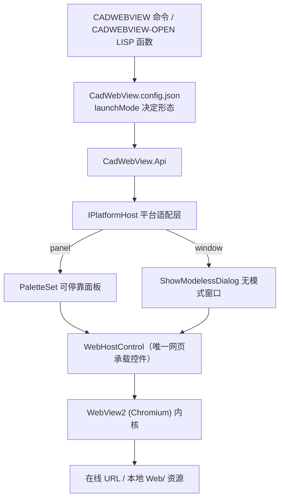

<div align="center">

# CadWebView

**在 CAD 里打开网页 —— 一套源码，覆盖 AutoCAD / 中望 ZWCAD / 浩辰 GstarCAD**

基于 WebView2（Chromium）内核，以**可停靠面板**或**无模式窗口**展示在线 URL 与本地 HTML。

[](LICENSE)
[](https://dotnet.microsoft.com/)
[](#平台与版本支持)
[](https://developer.microsoft.com/microsoft-edge/webview2/)

[中文](README.md) · [English](README.en.md)

</div>

---

## 目录

- [它解决什么问题](#它解决什么问题)
- [特性](#特性)
- [平台与版本支持](#平台与版本支持)
- [快速开始](#快速开始)
- [使用](#使用)
- [配置](#配置)
- [从源码构建](#从源码构建)
- [项目结构](#项目结构)
- [工作原理](#工作原理)
- [常见问题](#常见问题)
- [已知限制与路线图](#已知限制与路线图)
- [参与贡献](#参与贡献)
- [许可证](#许可证)

---

## 它解决什么问题

CAD 里经常需要看**帮助文档、在线看板、内部 Web 系统**，但把用户从图纸界面赶到系统浏览器，再切回来对图，非常割裂。

CadWebView 让你**不离开 CAD** 就能打开网页：

- 在 CAD 里执行一条命令 `CADWEBVIEW`，或用 LISP 函数 `(cadwebview-open "https://...")`；
- 页面直接显示在**可停靠面板**或**无模式浮动窗口**中，不阻塞绘图；
- AutoCAD、中望 ZWCAD、浩辰 GstarCAD 三家**共用同一套源码**，只有薄薄一层平台适配不同。

---

## 特性

- **一次编写，三平台通用** — 三家 CAD 的 .NET API 形状一致，靠 `#if` + `global using` 命名空间别名复用同一份适配源码。
- **现代渲染内核** — 采用 WebView2（Chromium），无需 IE 兼容模式注册表，不受 IE 内核渲染限制。
- **两种 UI 形态，同一控件** — 可停靠面板 / 无模式窗口共用 `WebHostControl`，由配置项切换，不会重复开窗（单例）。
- **在线 + 本地页面** — 支持任意 URL，也支持随插件分发的本地 `Web/` 目录资源（相对路径解析）。
- **LISP 原生入口** — 提供 `CADWEBVIEW-OPEN` 函数，脚本无需交互即可唤起网页。
- **配置驱动，命令行不打断** — 默认页面、启动形态、尺寸、降级页全部写在 `CadWebView.config.json`。
- **降级不崩** — 缺 WebView2 Runtime、页面加载失败均有内置提示页与下载链接，不抛异常、不阻断 CAD 启动。
- **AutoCAD 自动加载** — 打包为 AppBundle（`.bundle`），由 `PackageContents.xml` 按宿主版本段自动挑对应 DLL，无需 NETLOAD；另有 `deliver/AutoCAD/` 扁平目录，可用 `NETLOAD` 手动加载。

---

## 平台与版本支持

产物按 **平台 × 运行时家族** 划分（而非每个年份一份），同一家族内多个版本共用一份 DLL。

| 平台 | 覆盖版本 | 产物（目标框架） |
|---|---|---|
| AutoCAD | 2016 – 2024 | `CadWebView.AutoCAD.Fx.dll`（net462） |
| AutoCAD | 2025 – 2026 | `CadWebView.AutoCAD.N8.dll`（net8.0-windows） |
| AutoCAD | 2027+ | `CadWebView.AutoCAD.N10.dll`（net10.0-windows） |
| 中望 ZWCAD | 2025 – 2026 | `CadWebView.ZWCAD.Fx.dll`（net47） |
| 浩辰 GstarCAD | 2026 – 2027 | `CadWebView.GstarCAD.N8.dll`（net8.0-windows） |

各平台**垂直版**（机械 / 建筑 / 暖通 / 电气等）与基础版共用同一套基础 .NET API，**无需单独编译**，同一份 DLL 直接可用。

> **运行前提**：目标机器需存在 **Microsoft Edge WebView2 Runtime**（Win10 1809+ / Win11 及 AutoCAD 2025+ 环境通常已随 Edge 预装）。缺失时插件会显示提示页与下载链接，不会导致 CAD 崩溃。

---

## 快速开始

### 1. 环境要求

| 项 | 要求 |
|---|---|
| 操作系统 | Windows x64 |
| .NET SDK | **8** 与 **10**（分别用于 `net8.0-windows` / `net10.0-windows`；net462 由 NuGet 引用程序集提供） |
| CAD SDK | ObjectARX **2016 / 2025 / 2027**、ZWCAD SDK **2025**、GstarCAD SDK **2026** |
| 运行时 | Microsoft Edge WebView2 Runtime |

三家 SDK 默认从 `D:\SDK` 下按 [build/sdk-paths.props](build/sdk-paths.props) 约定的目录结构读取，也可用环境变量覆盖：

```powershell
$env:CadWebViewSdkRoot = 'E:\SDK'
```

**SDK 下载地址**

| SDK | 下载入口 |
|---|---|
| ObjectARX（AutoCAD 2016 / 2025 / 2027） | [ObjectARX for AutoCAD SDK](https://aps.autodesk.com/developer/overview/autocad-objectarx-sdk)（需 Autodesk 账号登录并同意许可协议；历史版本见 [Autodesk Developer Network](https://www.autodesk.com/developer-network/platform-technologies/autocad)） |
| ZWCAD SDK 2025 | [中望 CAD 开发支持](https://www.zwsoft.cn/support/zwcad-devdoc)（开发包 / 开发指南 / 参考手册 / 移植说明，另见 [中望 CAD 下载中心](https://www.zwsoft.cn/download)） |
| GstarCAD SDK 2026 | [浩辰 CAD 开发者工具](https://www.gstarcad.com/sdk_doc/)（GRXSDK 及各语言开发文档，另见 [浩辰开发者中心](https://www.gstarcad.com/developer/)） |

> 解压后请按 [build/sdk-paths.props](build/sdk-paths.props) 的约定放置：`D:\SDK\ARX\<2016｜2025｜2027>`、`D:\SDK\ZCAD\2025`、`D:\SDK\Gstar\2026\grxsdk`。

### 2. 获取代码

```powershell
git clone <本仓库地址> oddob-cadwebview
cd oddob-cadwebview
```

### 3. 一键构建与打包

```powershell
powershell -ExecutionPolicy Bypass -File build\build-all.ps1
```

可选参数：`-Version 1.2.0` 指定版本号（写入 `PackageContents.xml`），`-SkipBuild` 仅重新打包。

产物生成在 `deliver/`（该目录不入库，需自行构建）：

```
deliver/
├─ CadWebView.bundle/     # AutoCAD：整目录复制即自动加载
│  ├─ PackageContents.xml
│  └─ Contents/  Fx/ · N8/ · N10/ · Web/
├─ AutoCAD/               # AutoCAD：手动加载用，Fx/ · N8/ · N10/ 各一份（按版本选一个）
├─ ZWCAD/                 # 中望：DLL 直接加载
└─ GstarCAD/              # 浩辰：DLL 直接加载
```

### 4. 安装到 CAD

**AutoCAD（方式一：自动加载，推荐）** —— 把 `CadWebView.bundle` 整个目录复制到插件目录，重启 AutoCAD 即自动加载（无需 NETLOAD）：

- 当前用户：`%APPDATA%\Autodesk\ApplicationPlugins\`
- 全机器：`%PROGRAMDATA%\Autodesk\ApplicationPlugins\`

**AutoCAD（方式二：`NETLOAD` 手动加载）** —— 不想动插件目录时，按你的 CAD 版本选一个家族目录，用 `NETLOAD` 加载其中的 Host DLL：

| AutoCAD 版本 | 加载位置（`deliver` 目录下） |
|---|---|
| 2016 – 2024 | `AutoCAD\Fx\CadWebView.AutoCAD.Fx.dll` |
| 2025 – 2026 | `AutoCAD\N8\CadWebView.AutoCAD.N8.dll` |
| 2027+ | `AutoCAD\N10\CadWebView.AutoCAD.N10.dll` |

> - **整目录保留，不要只拷 Host DLL**：`CadWebView.Core.dll`、WebView2 依赖、`CadWebView.config.json`、`Web\` 都要与 Host DLL 同目录。
> - 手动加载**不会随 CAD 启动自动恢复**，新会话需重新 `NETLOAD`；长期部署建议用方式一。
> - 三个家族目录**不可合并**（`Core.dll` 与 WebView2 DLL 在不同 .NET 下是不同产物，会互相覆盖）。

**中望 ZWCAD** —— 用 `APPLOAD` 加载 `deliver\ZWCAD\CadWebView.ZWCAD.Fx.dll`。

**浩辰 GstarCAD** —— 用 `NETLOAD` 加载 `deliver\GstarCAD\CadWebView.GstarCAD.N8.dll`。

---

## 使用

### 命令 `CADWEBVIEW`

```text
命令: CADWEBVIEW
输入要打开的 URL <回车使用配置默认页>: https://www.baidu.com
```

- 输入**非空**内容 → 当作 URL 或本地相对路径直接打开；
- **直接回车** → 打开配置文件里的 `startUrl`；
- `Esc` → 取消，不打开任何容器。

启动形态由配置项 `launchMode` 决定（`panel` / `window`），**命令行不再询问**。重复调用同一形态会**激活已存在的实例并导航**，不会开出第二个窗口。

### LISP 函数 `CADWEBVIEW-OPEN`

```lisp
(cadwebview-open "https://www.baidu.com")
(cadwebview-open "D:/web/sample.html")   ; 本地路径用正斜杠，AutoLISP 中 "\" 是转义符
(cadwebview-open nil)                    ; 使用配置里的 startUrl
```

参数省略或为 `nil` 时使用配置默认页，形态同样由 `launchMode` 决定，返回 `1` 表示已受理。

也可以把 URL 当命令输入送入，效果等价（**必须带参数**，否则命令会停在提示处等键盘输入）：

```lisp
(command "CADWEBVIEW" "https://www.baidu.com")
```

### 本地页面

本地 HTML 放在插件目录的 `Web/` 子目录下，加载时按以下顺序解析相对路径：

```
<插件目录>/<url>  →  <插件目录>/Web/<url>  →  <插件目录>/../Web/<url>
```

最后一条对应 AppBundle 的 `Contents/<家族>/` 与 `Contents/Web/` 布局。仓库内 [Web/sample.html](Web/sample.html) 是随包分发的冒烟样例页。

---

## 配置

配置文件 `CadWebView.config.json` 放在**与插件 DLL 同目录**。文件缺失或解析失败时回退内置默认值，**不会抛出异常**。

```json
{
  // 默认打开的页面：在线 URL 或本地资源相对路径；about:blank 表示空白页
  "startUrl": "about:blank",

  // 启动形态：panel = 可停靠面板，window = 无模式窗口（默认）
  "launchMode": "window",

  // 加载失败时的降级页地址；留空则显示内置错误页
  "fallbackUrl": "",

  // 页面中新窗口请求（如 target=_blank）是否转交系统默认浏览器
  "openNewWindowInSystemBrowser": true,

  // 面板 / 窗口默认宽度（像素，需大于 0）
  "panelWidth": 1920,

  // 面板 / 窗口默认高度（像素，需大于 0）
  "panelHeight": 1080
}
```

| 键 | 类型 | 默认值 | 说明 |
|---|---|---|---|
| `startUrl` | string | `about:blank` | 回车 / `nil` 时打开的默认页面 |
| `launchMode` | string | `window` | `panel` 可停靠面板；`window` 无模式窗口。大小写不敏感，非 `window` 一律按 `panel` 处理 |
| `fallbackUrl` | string | 空 | 加载失败时的降级页；留空则用内置错误页 |
| `openNewWindowInSystemBrowser` | bool | `true` | 页面内 `window.open` / `target=_blank` 是否转交系统浏览器 |
| `panelWidth` / `panelHeight` | int | `1920` / `1080` | 面板与窗口共用的默认尺寸 |

> 配置文件支持 `//` 行注释与 `/* */` 块注释，解析前会先剥离；字符串里的 `https://` 不受影响。键名大小写不敏感，非法项一律退回内置默认。修改后重载插件或重启 CAD 生效。

---

## 从源码构建

```powershell
# 编译整个解决方案
dotnet build CadWebView.sln -c Release

# 编译 + 汇总 5 份产物 + 打包 AutoCAD .bundle
powershell -ExecutionPolicy Bypass -File build\build-all.ps1
```

约定与坑位：

- 全部产物为 **x64**；Core 多目标 `net462;net8.0-windows;net10.0-windows`，且**不引用任何 CAD 程序集**。
- 平台程序集一律 `Private=false`，厂商 DLL **不随交付**；WebView2 依赖靠 `CopyLocalLockFileAssemblies` 落盘。
- WebView2 托管包**最低只支持 net462**，这是 Fx 家族的下限（不能用 net45）。
- `build/build-all.ps1` 必须以 **UTF-8 with BOM** 保存，否则 Windows PowerShell 5.1 会按 GBK 解码而报语法错误。
- SDK 路径集中在 [build/sdk-paths.props](build/sdk-paths.props)，用 `CadWebViewSdkRoot` 覆盖。

---

## 项目结构

```
CadWebView.sln
├─ src/
│  ├─ Core/                      # 多目标 net462 / net8 / net10，无任何 CAD 引用
│  │   ├─ CadWebViewConfig.cs        # 配置模型 + 扁平 JSON 解析（零第三方依赖）
│  │   ├─ WebHostControl.cs          # 唯一网页承载控件（WebView2）
│  │   ├─ WebView2LoaderBootstrap.cs # 预加载随包分发的 WebView2Loader.dll
│  │   ├─ IPlatformHost.cs           # 适配契约
│  │   └─ Api.cs                     # 对外 API + RegisterHost
│  ├─ Host.Shared/               # 共享适配源码，被各 Host 工程 Link 引用
│  │   ├─ PlatformAliases.cs         # 三家命名空间 global using 别名
│  │   ├─ PlatformHost.cs            # 面板 / 无模式窗口（各自单例）
│  │   ├─ CadWebViewCommands.cs      # CADWEBVIEW 命令 + CADWEBVIEW-OPEN 函数
│  │   └─ PlatformExtensionApplication.cs
│  └─ Hosts/                     # 薄适配层，每「平台 × 运行时家族」一份
│     ├─ AutoCAD.Fx/ (net462)   AutoCAD.N8/ (net8)   AutoCAD.N10/ (net10)
│     ├─ ZWCAD.Fx/  (net47)
│     └─ GstarCAD.N8/ (net8)
├─ build/                        # 构建脚本、AppBundle 清单模板、配置模板、SDK 路径
├─ Web/sample.html               # 冒烟样例页
└─ deliver/                      # 构建产物（.gitignore 忽略，可复现）
```

---

## 工作原理



1. **Core 与 CAD 完全解耦** —— 网页承载、配置解析、降级逻辑都在 Core，可跨运行时多目标编译。
2. **平台差异集中在一小段适配代码** —— 三家 API 同形，`#if ACAD / ZWCAD / GSTARCAD` + `global using` 别名即可复用，无需写三遍。
3. **每「平台 × 运行时家族」产出一份 DLL** —— 由各自的加载机制分发；AutoCAD 侧交由 `PackageContents.xml` 版本段自动筛选。

---

## 常见问题

**Q：执行命令提示 WebView2 Runtime 缺失？**
装 `Microsoft Edge WebView2 Runtime` 后重启 CAD。Win10 1809+ / Win11 通常已随 Edge 预装；AutoCAD 2025+ 环境一般也已具备。

**Q：命令完全没反应 / 提示未知命令？**
确认插件已加载：AutoCAD 方式一检查 `CadWebView.bundle` 是否放在 `ApplicationPlugins` 下且重启过（另注意 `PackageContents.xml` 的版本段是否覆盖你的 CAD 版本）；方式二确认已 `NETLOAD` `deliver\AutoCAD\<家族>\` 下**与你的 CAD 版本对应**的 Host DLL，并且整目录文件齐全；中望 / 浩辰确认对应 DLL 已通过 `APPLOAD` / `NETLOAD` 加载。

**Q：三平台能用同一份 DLL 吗？**
不能。三家命名空间与程序集不同（`Autodesk.AutoCAD.*` / `ZwSoft.ZwCAD.*` / `Gssoft.Gscad.*`），各平台需各自的一份产物。

**Q：为什么用 `ShowModelessDialog` 而不是 `form.Show()`？**
无模式窗口必须用 CAD 自身的显示 API，才能与主窗口正确关联，避免焦点与线程问题（三家同形）。

**Q：为什么 Fx 家族目标是 net462 而不是 net45？**
WebView2 托管包最低只支持 net462，这是硬性下限。

**Q：换台机器要重新打包吗？**
不用。产物是 framework-dependent 的，只要机器有对应的 .NET 运行时和 WebView2 Runtime 即可运行。

---

## 已知限制与路线图

- **实测覆盖有限** —— 目前仅 AutoCAD 2016 / 2018 / 2020 / 2022 / 2024（`Fx`）、2026（`N8`）、中望CAD 2025 / 2026 / 2027 完成实机验证；浩辰仍待逐版本实测。
- **依赖 WebView2 Runtime** —— 未装时无法渲染（有提示页兜底）。
- **本期不做** —— Ribbon / 菜单 / 状态栏仅作为打开入口，不作为容器；绘图区叠加层、图形内嵌实体、图纸超链接均不实现；不提供安装器。

---

## 参与贡献

欢迎 Issue 与 Pull Request。

1. Fork 本仓库并从 `main` 拉出特性分支；
2. 保持 **Core 不含任何 CAD 引用**、平台差异只写在 `Host.Shared` / `Hosts/*` 的约定；
3. 涉及平台 API 的改动，请注明所依据的 SDK 版本与实测环境；
4. 提交 PR 前请确认 `dotnet build CadWebView.sln -c Release` 通过。

提交信息请说明**为什么改**，而不只是改了什么。

---

## 许可证

本项目基于 [MIT 许可证](LICENSE) 开源。

WebView2 及其相关组件由 Microsoft 提供，遵循其各自的许可条款。
